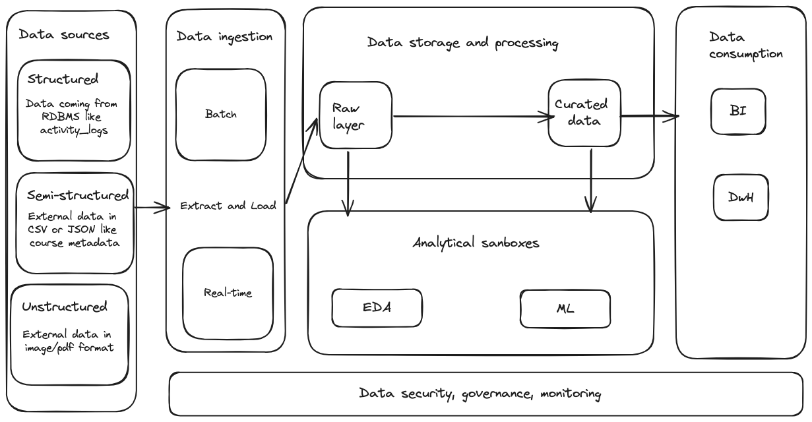

# openfoodfacts-etl
A pipeline to extract the data for some products from the openfoodfacts API and load to a Postgres database

## 1. Programming tasks

### 1.1

#### c)

1. **Inconsistent Data Formats**: Ingredients data is provided in various formats, such as lists and nested dictionaries.
2. **Multilingual Data**: Data is in multiple languages, which complicates standardization and analysis.
3. **Data Duplication**: Duplicate entries might occur if the same ingredient is listed multiple times with slight variations.

#### d)

The best place would be to use "Secrets management services" provided by cloud providers to securely store and manage access to credentials.

In AWS it's called AWS Secrets Manager whereas in GCP it is known by Google Secret Manager.

#### a) b) e)

Code: https://github.com/shashankwadhwa9/openfoodfacts-etl/blob/main/pipelines/task1.py

Output: https://github.com/shashankwadhwa9/openfoodfacts-etl/blob/main/output/task1.csv

### 1.2

#### a)

Code: https://github.com/shashankwadhwa9/openfoodfacts-etl/blob/main/pipelines/task2.py

Output: https://github.com/shashankwadhwa9/openfoodfacts-etl/blob/main/output/task2a_category_count.csv

#### b)

Code: https://github.com/shashankwadhwa9/openfoodfacts-etl/blob/main/pipelines/task2.py

Output: https://github.com/shashankwadhwa9/openfoodfacts-etl/blob/main/output/task2b_min_max_nutriscore_categories.csv

#### c)

Code: https://github.com/shashankwadhwa9/openfoodfacts-etl/blob/main/pipelines/task2.py

Output: https://github.com/shashankwadhwa9/openfoodfacts-etl/blob/main/output/task2c_extreme_nutriscores.csv

#### d)

I replaced all the missing data with a string `Unknown`.

Using a placeholder like "Unknown" makes it clear that the data is missing, as opposed to leaving the field blank or using NaN and also maintains the consistency of data types within the column.

Code: https://github.com/shashankwadhwa9/openfoodfacts-etl/blob/main/pipelines/task2.py

Output: https://github.com/shashankwadhwa9/openfoodfacts-etl/blob/main/output/task2d_products_with_replaced_origins.csv

### 1.3

Code: https://github.com/shashankwadhwa9/openfoodfacts-etl/blob/main/pipelines/task3.py

#### How to run?
```
# Pull the PostgreSQL image
docker pull postgres

# Run a PostgreSQL container
docker run --name postgres-container -e POSTGRES_PASSWORD=admin -d -p 5432:5432 postgres

# Run the pipeline
python pipelines/task3.py
```

### 1.4

Python Code: https://github.com/shashankwadhwa9/openfoodfacts-etl/blob/main/pipelines/task4.py

Dockerfile: https://github.com/shashankwadhwa9/openfoodfacts-etl/blob/main/Dockerfile

docker-compose: https://github.com/shashankwadhwa9/openfoodfacts-etl/blob/main/docker-compose.yml

#### How to run?
```
docker-compose up -d db

docker-compose run etl
```

## 2. Architecture task

 

#### a)

Essential Components

1. Ingestion Layer
2. Storage Layer
3. Processing Layer
4. Data Catalog and Governance
5. Security Layer
6. Consumption Layer
7. Monitoring and Management

#### b)
For the processed/curated data I would chose `Parquet` because of its efficient columnar storage format which allows for better compression and performance for analytical queries. It's well-suited for large-scale data processing and supports schema evolution.

In the raw layer it can be flexible depending on our data source.

#### c)

Data Governance: PII columns should be tagged properly in our data warehouse and data catalog.

Access Control: We would implement fine-grained access control to restrict access to PII data. Only authorized users and service accounts should be able to access this data.

#### d)

Infrastructure as Code (IaC): We will use Terraform or AWS CloudFormation to manage and provision infrastructure resources in a consistent and repeatable manner.